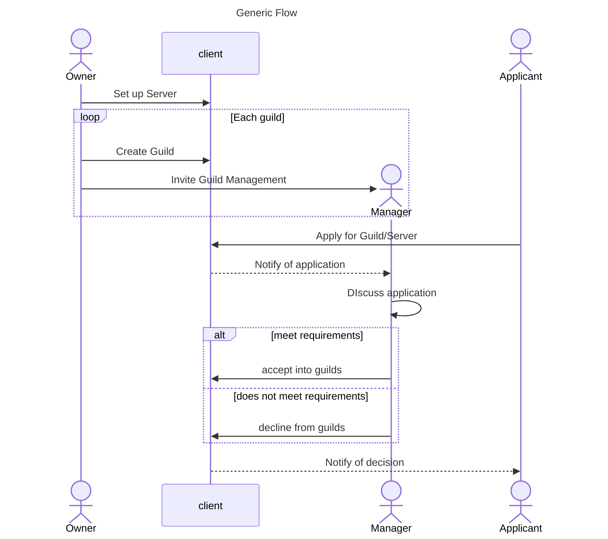

```mermaid
---
title: Generic Flow
---
sequenceDiagram
actor O as Owner
participant C as client
O->>C: Set up Server
loop Each guild
    O->>C: Create Guild
    create actor M as Manager
    O->>M: Invite Guild Management
end
actor A as Applicant
A->>C: Apply for Guild/Server
C-->>M: Notify of application
M->>M: DIscuss application
alt meet requirements
    M->>C: accept into guilds
else does not meet requirements
    M->>C: decline from guilds
end
C-->>A: Notify of decision
```